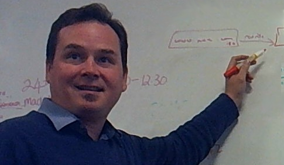

---

{:class="image right"}

Our Principal Consulting Software Developer, Peter Bayne, has been involved in software development teams since the mid-90s using technologies such as AWS, Python, and .Net, and most recently F#. Working in industries as broad-ranging as forestry science, factory automation, commerce, and hospital logistics.  
His experience includes Technical Consultant at [Double-O](http://doubleo.nz){:target="_blank"}, leading the Software Development Practices group at [Assurity](http://assurity.co.nz){:target="_blank"}, Product lead at [Atlas Tech](http://atlastech.co.nz/){:target="_blank"}, and Senior Scientist at [Scion Research](https://scionresearch.com/){:target="_blank"}.  

---

{:class="image"}
  
  
Technical consulting and leadership in association with [Double-O Consulting](http://doubleo.nz){:target="_blank"}.  

Specialising in emergent architecture and technical practices such as test driven development.
Particular focus on the Callaghan [Build For Speed](https://www.callaghaninnovation.govt.nz/innovation-skills/build-speed){:target="_blank"} improvement programme for startups.

---

{:class="image right"}

### [{{ site.posts.first.title }}]({{site.posts.first.url}})

{:class="excerpt"}
{{ site.posts.first.excerpt }}

{:class="excerpt"}
[read more >]({{site.posts.first.url}})

To read {{ site.posts.size }} more posts [Click here >](/blog)
