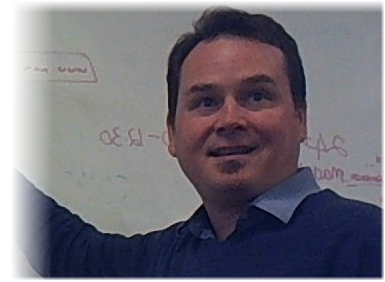

{:class="right"}
Primarily a software developer, Peter Bayne has been involved in software development teams since the mid-90s using technologies from C++ to Java and .Net, and most recently F#. Working in industries as broad-ranging as forestry science, factory automation, commerce, and hospital logistics.  
His experience includes leading the Software Development Practices group at [Assurity](http://assurity.co.nz){:target="_blank"}, Product lead at [Atlas Tech](http://atlastech.co.nz/){:target="_blank"}, and Senior Scientist at [Scion Research](https://scionresearch.com/){:target="_blank"}.  

Technical consulting and leadership in association with [Double-O Consulting](http://doubleo.nz){:target="_blank"}.
Particular focus on the Callaghan "Build For Speed" improvement programme for startups.

{:class="right"}
<ul>
  
    <li>
      <a href="{{ post.url }}">{{ post.title }}</a>
    </li>
  
</ul>
