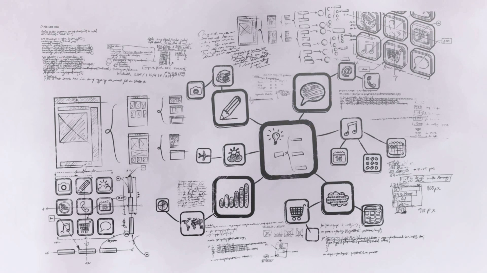
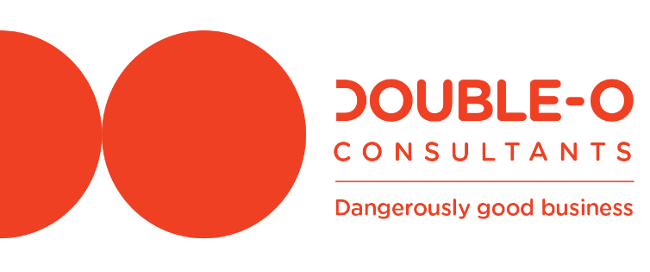
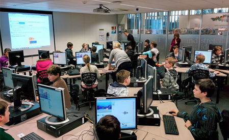

---

{:class="image right"}
  

something about development

---

{:class="image"}
  

Technical consulting and leadership in association with [Double-O Consulting](http://doubleo.nz){:target="_blank"}.  

Specialising in emergent architecture and technical practices such as test driven development.
Particular focus on the Callaghan [Build For Speed](https://www.callaghaninnovation.govt.nz/innovation-skills/build-speed){:target="_blank"} improvement programme for startups.

---

{:class="image right"}
  

something about code club

---

{:class="image"}
  

something about pete the programmer

---

{:class="image right"}



### [{{ titles  | array_to_sentence_string: "-" }}]({{site.posts.first.url}})

{:class="excerpt"}
({{site.posts.first.date | date_to_string}} - {{site.posts.first.tags | array_to_sentence_string}})

{:class="excerpt"}
{{ site.posts.first.excerpt }}

{:class="excerpt"}
[read more >]({{site.posts.first.url}})

To read {{ site.posts.size }} more posts [Click here >](/blog)
